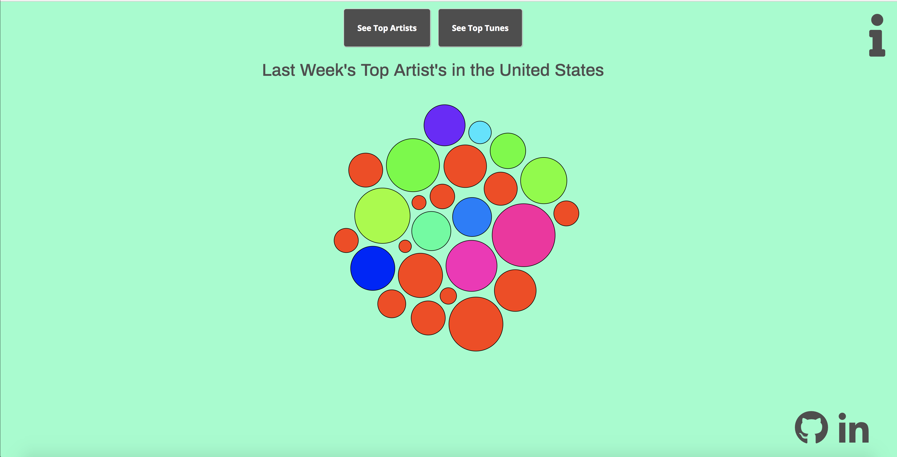
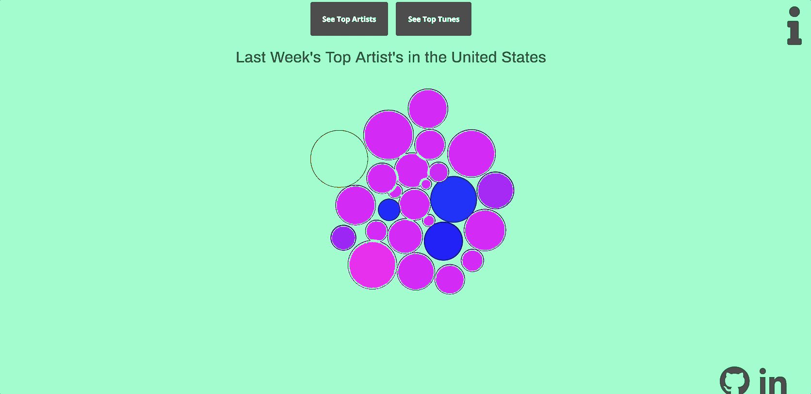

# Tunes of the Week
[Live Demo](https://robertfarb.github.io/tunes-of-the-week/)

Tunes of the week is an application built with JavaScript and D3.js that visualizes the top hits from last week using the Last.fm API.
I utilized the D3.js library to append data to a bubble chart, and determine the size of each bubble based on how many listeners a song or artist had during the week.

As this project was planned and built on a 5 deadline, I plan to make enhancements with each new iteration of the application.

This README covers

- [Technologies](Technologies)
- [Features](features)
- [Planning & Design](Design)
- [Future Features](Future&%20Features)

## Features

### Select Top Artists or Tracks

Users have the option to see top artists or top tunes; an API call to Last.fm will be made and fetch the correct information when a user clicks top artists or top tunes. I accomplished this by conditionally pinging the API to fetch the user requested information.

```js
 topArtists.addEventListener("click", () => {
    showBubbles('artists');
    header.textContent = "Last Week's Top Artist's in the United States";
  })

  topTunes.addEventListener("click", () => {
    showBubbles('tunes');
    header.textContent = "Last Week's Top Tunes in the United States";
  })
```





### Bubble Interactivity


Users can see the Artist / Track name and how many listeners they had during the week on hover. I accomplished this by adding a tooltip to the all of the D3 circles and adding the display class on mouseover.

I executed the bubble dragging feature using D3.js forceSimulation() and writing a dragStart and dragEnd function that resets the alpha target on drag.

```js
  let dragStarted = (d) => {
    return (!d3.event.active) ? force.alphaTarget(0.3).restart() : null;
  }

  let dragged = (d) => {
    if (!d3.event.active) {
      force.alphaTarget(0.3).restart();
    }
    d.fx = d3.event.x;
    d.fy = d3.event.y;
  }

  let dragEnded = (d) => {
    d.fx = null;
    d.fy = null;
    d3.select(this).classed("active", false);
  }
```


## Technologies
Tunes of the Week was built using vanilla Javascript, D3.js and SVG graphics.

## Design Docs
* [Proposal Readme](https://github.com/Robertfarb/tunes-of-the-week/blob/master/docs/proposal_readme.md)

## Ideas for future features
- Users will be able to filter top hits by Genre, grouping bubbles in their respective category
- Users can play an artist's top hit on hover of a bubble