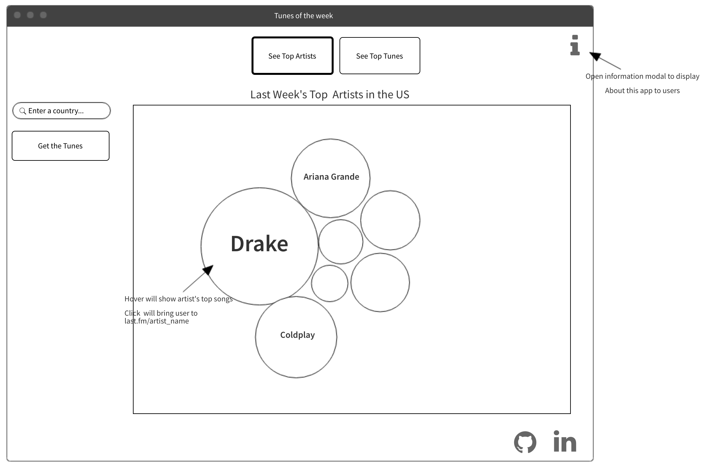

# Tunes of the Week
### Background and Overview

Tunes of the week is a data visuaization using D3.js and the Last.fm public API to provide users with last week's top artist's and last week's top tunes filtered by country.

The size of the circles on the graph will be determined by how many plays the artist / album got during the week. User's can select top artist's or top tunes by clicking a button at the top of the page, and then enter their countrty of choice in a searchbar on the left of the screen.

### Functionality & MVP  

In Tunes of the Week, users can:

- [ ] Select if they'd like to see artists or tracks
- [ ] By clicking one of the buttons it will display top tracks or top tunes
- [ ] Search for a country of choice to display filtered top tunes
- [ ] Double click a Bubble to navigate to the artist / track page on last.fm

Additional Features
- [ ] An about modal describing the project's insipration, and functionality

### Wireframes

This app will have a single screen in which I will manipulate dom elements based on click of Tracks / Artists. There will be nav links to the github repo, and my linked in in the lower right corner of the page, and a button with on click functionality to open the modal in the top right corner of the page.  

### Technologies

This project will be implemented with the following technologies:

- Vanilla JavaScript for overall structure and DOM manipulation,
- `D3.js` for rendering the bubble chart,
- `Lastfm API` for fetching top hits information
- Webpack to bundle and serve up the various scripts

In addition to the webpack entry file, there will be two scripts involved in this project:

`artists.js`: this script will fetch and update the necessary DOM elements for top artists.

`tracks.js`: this script will fetch and update the necessary DOM elements for top tracks.

### Implementation Timeline

**Over the weekend**:
- [x] Research LastFM API and D3.js in order to begin implementation on Monday
- [x] Refresher on HTML Canvas to render canvas for bubble chart
- [x] Setup project filetree, and package.json
- [x] Install npm d3 package and research methods I'll need for my visualization

**Day 1**: Write the shell for the artists.js and tracks.js, Get the API calls completed, and Add two buttons to the homescreen which will render tracks or artists.  Goals for the day:

- [ ] Get `webpack` serving files and frame out index.html
- [ ] Research enough D3 to save each circle as a dom node and append data to corresponding circles
- [ ] Sucessfully make API calls and have relevant data coming back in a useable structure
- [x] Complete filetree including index.html and main.css (choose fonts and background image for the page)
- [ ] Research D3 enough to know how to render the interactive bubble chart

**Day 2**: Completely dive into D3.js and create the circles that will populate the chart. Manipulate the circle sizes dependent on their data, and add the artist name as data to the circle

- [ ] Complete artists.js and add functional button on index.html which will call the function
- [ ] Get sounds to play on collisions
- [ ] Build first sound library
- [ ] Get collision graphics working
- [ ] Make the `Asteroid`s able to be created with mouse. Set vectors on mouse release.

**Day 3**: Make the functional search bar that will allow users to see top hits filtered by country

- [ ] Render a form on the index.html
- [ ] on submit the form will create an api call url and send a request to last.fm api to retreive information
- [ ] Populate data in the bubble-chart

**Day 4**: Add hover and click events to the chart that will display information about the songs / Add image backgrounds to each individual node.

- [ ] Add hover events to all bubbles to display track / artist info.
- [ ] Add background images to each bubble
- [ ] Add animation effects to the bubble chart (user mouse interactivity)
- [ ] Have a styled `Canvas`, good looking background image and well styled buttons

### Bonus features

- [ ] - Allow User to filter by Genre
- [ ] - Play an artist's top hit on hover of a bubble
